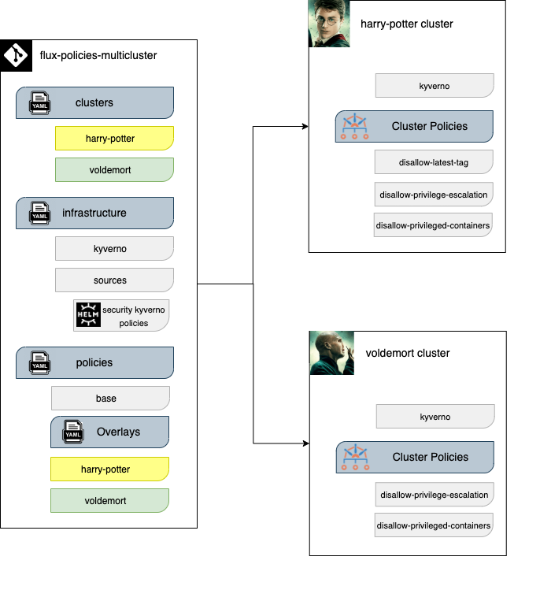

# Flux Policies Multicluster

For this example we assume a scenario with two clusters: harry-potter and voldemort.
The end goal is to leverage Flux and Kustomize to manage both clusters while minimizing duplicated declarations.

We will configure Flux to install, test and upgrade [Kyverno](https://kyverno.io/) and a [set of policies](https://github.com/rcarpio-hbo/security-kyverno-policies) using
`HelmRepository` and `HelmRelease` custom resources.



## Prerequisites

You will need a Kubernetes cluster and kubectl.
For a quick local test, you can use [Kubernetes kind](https://kind.sigs.k8s.io/docs/user/quick-start/) or [Minikube](https://minikube.sigs.k8s.io/docs/).
Any other Kubernetes setup will work as well though.

In order to follow the guide you'll need a GitHub account and a
[personal access token](https://help.github.com/en/github/authenticating-to-github/creating-a-personal-access-token-for-the-command-line)
that can create repositories (check all permissions under `repo`).

Install the Flux CLI using the official documentation: [Install the Flux CLI](ttps://fluxcd.io/flux/installation/#install-the-flux-cli)

## Repository structure

The Git repository contains the following top directories:

- **charts** dir contains packed helm charts.
- **clusters** dir contains the Flux configuration per cluster.
- **infrastructure** dir contains common infra tools such as kyverno and Helm repository definitions.
- **policies** dir contains Helm releases with a custom configuration per cluster.

```
├── charts
│   └── kyverno
├── clusters
│   ├── harry-potter
│   │   └── flux-system
│   └── voldemort
│       └── flux-system
├── infrastructure
│   ├── kyverno
│   └── sources
└── policies
    ├── base
    ├── harry-potter
    └── voldemort
```

The policies configuration is structured into:

- **policies/base/** dir contains namespaces, the helm values file and the Helm release definition. We used [Kustomize ConfigMap generator](https://fluxcd.io/flux/guides/helmreleases/#refer-to-values-in-configmaps-generated-with-kustomize) to generate confimaps from the values.yaml file which will be inherited by the Helm Release definition.
A Helm release upgrade will be triggered every time the encoded values change.
- **policies/harry-potter/** dir contains the harry-potter Helm release values
- **policies/voldemort/** dir contains the helm values.yaml and a Kustomize patch with specific values for the voldemort cluster.

```
./policies/
├── base
│   ├── kustomization.yaml
│   ├── kustomizeconfig.yaml
│   ├── namespace.yaml
│   ├── policies-release.yaml
│   └── policies-values.yaml
├── harry-potter
│   ├── kustomization.yaml
│   └── policies-values.yaml
└── voldemort
    ├── kustomization.yaml
    ├── policies-release-patch.yaml
    └── policies-values.yaml
```

Note that with `version: "0.1.1"` we configure Flux to deploy directly the policies helm chart version `"0.1.0"`. If we would like to automatically upgrade
the `HelmRelease` to the latest chart version including alpha, beta and pre-releases, `version: ">=0.1.0"` must be used. In case you would like to ignore alpha, beta and pre-releases, use `version: ">=1.0.0"`.


Infrastructure:

- **infrastructure/sources/** dir we have the Helm repositories definitions.
- **kyverno/** dir contains the kyverno Helm release values

```
./infrastructure/
├── kustomization.yaml
├── kyverno
│   └── v2.6.0
│       ├── kustomization.yaml
│       ├── kyverno-release.yaml
│       └── namespace.yaml
└── sources
    ├── kustomization.yaml
    └── policies-helmRepository.yaml
```

## Bootstrap harry-potter and voldemort clusters

The clusters dir contains the Flux configuration:

In **clusters/harry-potter/** dir we have the Kustomization definitions.

```
./clusters/
├── harry-potter
│   ├── flux-system
│   │   ├── gotk-components.yaml
│   │   ├── gotk-sync.yaml
│   │   └── kustomization.yaml
│   ├── infrastructure.yaml
│   └── policies.yaml
└── voldemort
    ├── flux-system
    │   ├── gotk-components.yaml
    │   ├── gotk-sync.yaml
    │   └── kustomization.yaml
    ├── infrastructure.yaml
    └── policies.yaml
```

Fork this repository on your personal GitHub account and export your GitHub access token, username and repo name:

```sh
export GITHUB_TOKEN=<your-token>
export GITHUB_USER=<your-username>
export GITHUB_REPO=<repository-name>
```

Start a new cluster called harry-potter with Minikube:

```sh
minikube start -p harry-potter
```

Verify that your harry-potter cluster satisfies the prerequisites with:

```sh
flux check --pre
```

Bootstrap Flux:

```sh
flux bootstrap github \
    --context=harry-potter \
    --owner=${GITHUB_USER} \
    --repository=${GITHUB_REPO} \
    --branch=main \
    --personal \
    --path=clusters/harry-potter
```

Give some time to the resources to be created:

```console
$ kubectl get -A helmreleases
NAMESPACE           NAME       AGE   READY   STATUS
kyverno             kyverno    78s   True    Release reconciliation succeeded
security-policies   policies   48s   True    Release reconciliation succeeded

$ kubectl get -A kustomizations
NAMESPACE     NAME             AGE     READY   STATUS
flux-system   flux-system      2m23s   True    Applied revision: main/5c96bac16c795b13b0a73d7b7d2a22778e2c87cd
flux-system   infrastructure   80s     True    Applied revision: main/5c96bac16c795b13b0a73d7b7d2a22778e2c87cd
flux-system   policies         80s     True    Applied revision: main/5c96bac16c795b13b0a73d7b7d2a22778e2c87cd

$ kubectl get -A gitrepositories
NAMESPACE     NAME          URL                                                           AGE     READY   STATUS
flux-system   flux-system   ssh://git@github.com/rcarpio-hbo/flux-policies-multicluster   2m23s   True    stored artifact for revision 'main/5c96bac16c795b13b0a73d7b7d2a22778e2c87cd'

$ kubectl get -A helmcharts
NAMESPACE     NAME                         CHART                              VERSION   SOURCE KIND      SOURCE NAME   AGE   READY   STATUS
flux-system   kyverno-kyverno              charts/kyverno/kyverno-2.6.0.tgz   2.6.x     GitRepository    flux-system   79s   True    pulled 'kyverno' chart with version '2.6.0'
flux-system   security-policies-policies   security-kyverno-policies          0.1.0     HelmRepository   policies      49s   True    pulled 'security-kyverno-policies' chart with version '0.1.0'

$ kubectl get -A helmrepositories
NAMESPACE     NAME       URL                                                       AGE   READY   STATUS
flux-system   policies   https://rcarpio-hbo.github.io/security-kyverno-policies   79s   True    stored artifact for revision 'd2b9a652dc7966ccbfb46dc93967f7ebf5013a4c56631b8c7247ed4dabbe8588'
```

Verify that the policies have been created:

```console
$ kubectl get cpol           
NAME                             BACKGROUND   VALIDATE ACTION   READY
disallow-latest-tag              true         enforce           true
disallow-privilege-escalation    true         enforce           true
disallow-privileged-containers   true         enforce           true
```

Start another cluster called voldemort with Minikube:
```sh
minikube start -p voldemort
```

Bootstrap Flux on voldemort by setting the context and path to your voldemort cluster:

```sh
flux bootstrap github \
    --context=voldemort \
    --owner=${GITHUB_USER} \
    --repository=${GITHUB_REPO} \
    --branch=main \
    --personal \
    --path=clusters/voldemort
```

Watch the voldemort reconciliation:

```console
$ kubectl get cpol
NAME                             BACKGROUND   VALIDATE ACTION   READY
disallow-privilege-escalation    true         enforce           true
disallow-privileged-containers   true         audit             true
```

## References
- [here](https://github.com/fluxcd/flux2-kustomize-helm-example) from fluxcd.